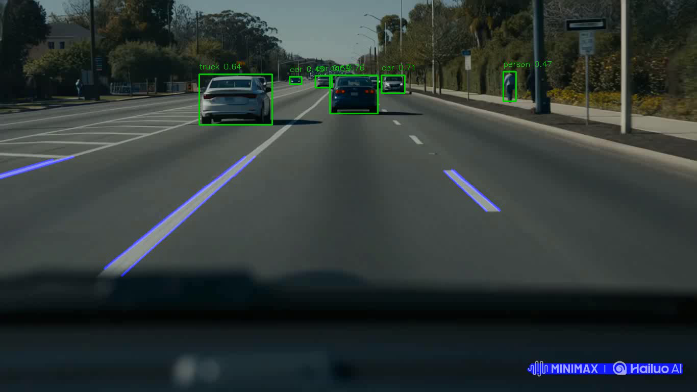

# Lane-Object-Detection

This project integrates lane following and object detection using ROS 2 & OpenCV. It demonstrates real-time processing of video or camera input to detect lane lines and objects simultaneously.

---

## Tech Stack

- ROS 2 (Humble)
- Python 3
- OpenCV
- YOLOv5 (for object detection)

---

## Project Structure

lane_ws/
├── src/
│ └── lane_follower/
│ ├── package.xml
│ ├── setup.py
│ ├── resource/
│ ├── lane_follower/
│ │ ├── init.py
│ │ └── lane_follower_node.py
│ ├── test/
│ └── lanevideo.mp4

*Note: Adapt the above structure according to your actual project layout.*

---

## Features

- Supports real-time processing of test video or camera feed using OpenCV
- Detects lane lines with grayscale, Gaussian blur, Canny edge detection, and Hough Transform
- Detects and labels objects (person, car, etc.) using YOLOv5
- Draws lane lines and object bounding boxes on the output video
- Publishes ROS Twist commands for robot control based on lane detection (for ROS integration)
- Saves output video with combined lane and object detection results

---

## How to Run

1. **Build the ROS 2 workspace:**

  cd ~/lane_ws
  colcon build
  source install/setup.bash

2. Run the lane follower node:

ros2 run lane_follower lane_follower_node

3. Run the fusion Python script (lane + object detection):

python3 fusion.py

---

## Project Result

---

## Future Improvements

- Integrate with real robot hardware for live control
- Add simulation support via Gazebo or RViz
- Replace video input with real-time USB camera feed
- Improve lane detection accuracy and robustness
- Tune control commands with PID controller
- Add launch files and parameter support for ROS 2

---

##License

This project is licensed under the MIT License.

---

## Author

GitHub: Gyuhyeok001

