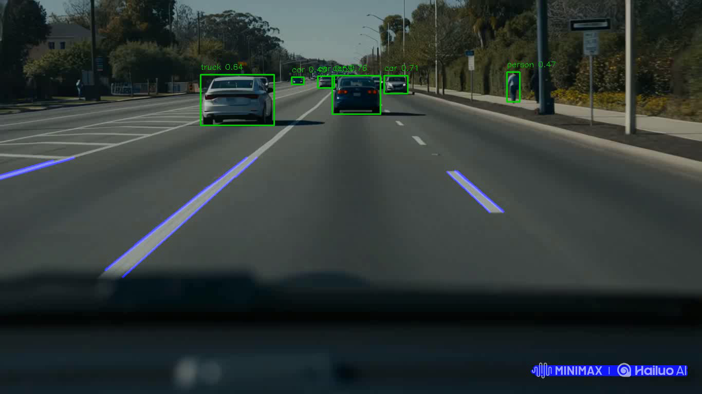

# Lane-Object-Detection

This project integrates lane following and object detection using ROS 2, OpenCV, and YOLOv5.  
It demonstrates frame-by-frame processing of video input to detect lane lines and objects simultaneously, and generates ROS 2 `Twist` commands for robot control.

---

## Tech Stack

- ROS 2 (Humble)
- Python 3
- OpenCV
- PyTorch
- YOLOv5 (object detection)

---

## Project Structure

Example project layout:
Lane-Object-Detection/
├── fusion.py                     # Main script: lane + object fusion + Twist commands
├── lane_tracking/
│   └── lane.py                   # Classical lane detection (Canny + Hough)
├── yolov5/                       # YOLOv5 code (as a submodule or copied repo)
├── input/
│   └── input.video.mp4           # Test input video
├── output/
│   ├── fusion_output.mp4         # Output video (lane + object overlays)
│   └── fusion_output_thumbnail.png
├── requirements.txt
└── README.md

*Note: Adapt the above structure according to your actual project layout.*

---

## Features
- Processes a test video (or camera feed, with minor changes) using OpenCV
- Detects lane lines using grayscale conversion, Gaussian blur, Canny edge detection, and Hough Transform
- Detects and labels objects (person, car, etc.) using YOLOv5
- Overlays lane lines and object bounding boxes on the output video
- Generates ROS 2 geometry_msgs/Twist commands for robot control based on lane geometry
- Saves the fused lane + object detection result as an output vide

---

## How to Run

1) Source your ROS 2 environment (example: Humble)
source /opt/ros/humble/setup.bash

2) Clone the repository and install Python dependencies
git clone <this-repo-url>
cd Lane-Object-Detection
pip install -r requirements.txt

3) Run the fusion script (lane + object detection + ROS 2 Twist commands)
python3 fusion.py

*If you want to inspect the velocity commands in another terminal*
source /opt/ros/humble/setup.bash
ros2 topic echo /cmd_vel

---

## Project Result

[Download Fusion Output Video](./output/fusion_output.mp4)

---

## Future Improvements

- Integrate with real robot hardware for live control
- Add simulation support via Gazebo or RViz
- Replace video input with real-time USB camera feed
- Improve lane detection accuracy and robustness
- Tune control commands with PID controller
- Add launch files and parameter support for ROS 2

---

## License

This project is licensed under the MIT License.

---

## Author

GitHub: Gyuhyeok001

